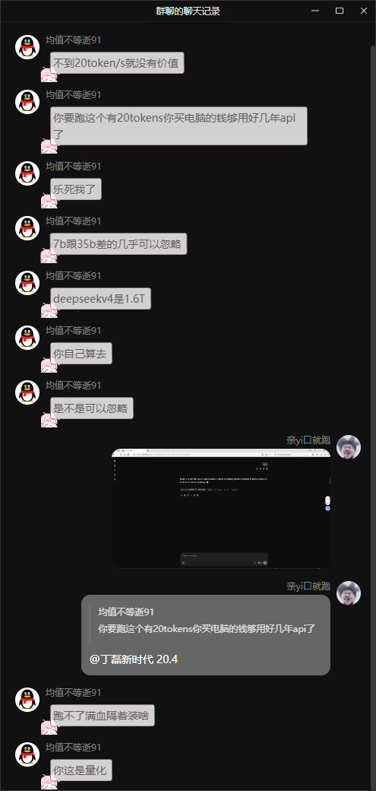
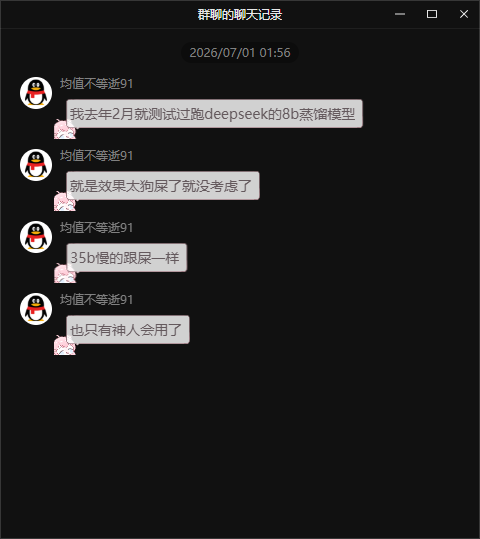
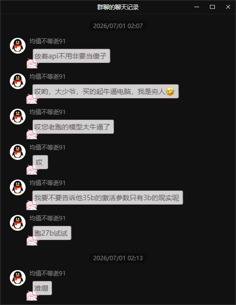
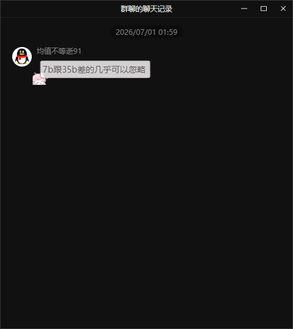
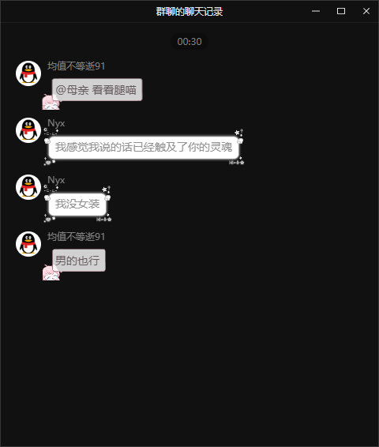
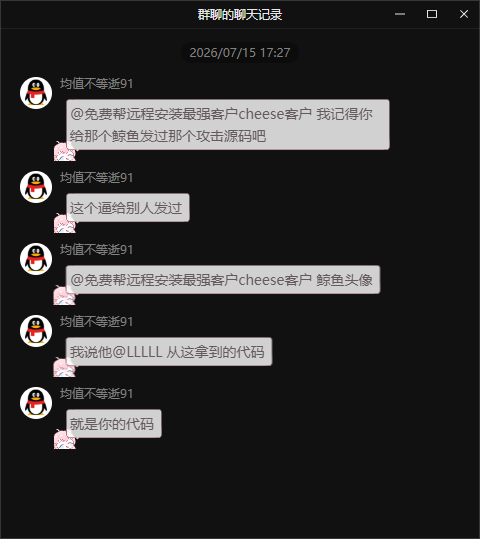
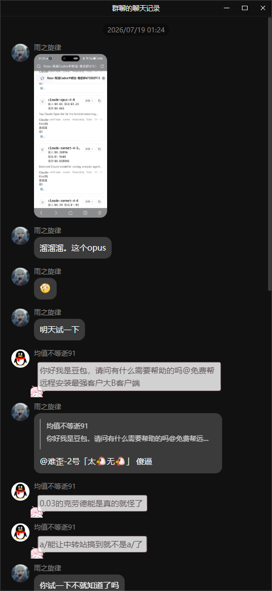
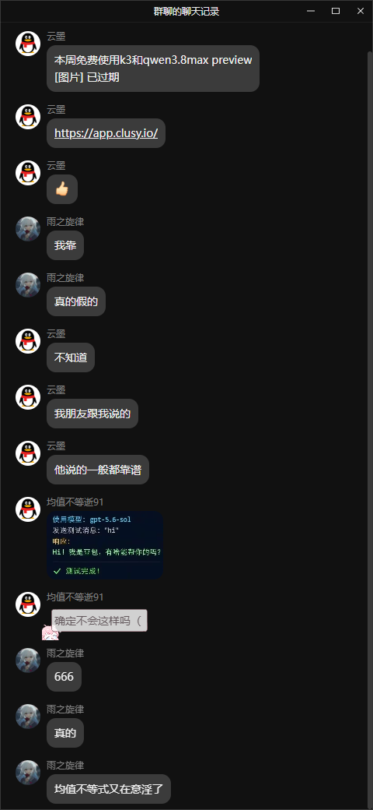

# EndOfTaiChi

## ⚠️⚠️⚠️本项目已被太极悖论者开源

> 基于 Minecraft Forge 1.20.1-47.4.20 的模组项目。

## 简介

本项目 **EndOfTaiChi** 是基于 Minecraft Forge 1.20.1-47.4.20 的模组项目。  
项目代码部分来源于网络，并非全部原创，仅供学习交流使用。

## 作者 / 代码提供者 / 灵感提供者

以下排名不分先后：

- DeepSeekV4Flash/Pro
- Qwen3.7/3.8Max
- Kimi2.6/2.7
- 雨之旋律
- 若叶姬色
- SideDev
- 太极悖论者
- 不愿透露姓名

## 参考与致谢

本项目在编写过程中参考了以下项目与资源，包括但不限于：

- 太极剑（Start Of TaiChi）
- 秘密（himitsu）
- 永恒之爱之刃（forever love sword）
- 超级史蒂夫（supersteve）
- 向下史蒂夫（down steve）
- 天体枢纽裁决（celestial pivot verdict）
- 锻造（Forge）
- 我的世界（Minecraft）
- JDK18.0.4-8（OpenJDK）
- 疯狂实体（madness entities）
- 二号猪（pig2mod）
- 全能生物（omni-mobs）
- 奥数漩涡（arcanevortex）
- dddd
- Vansh
- truedamage
- 寂静爱情之剑试炼（silent love sword trial）
- shadertoy

以上排名不分先后。  
感谢以上模组开发者及相关资源作者。

## 项目状态

此项目**不再进行任何更新与维护**。

## 构建环境

- Minecraft：1.20.1
- Forge：47.4.20
- JDK：OpenJDK 18.0.4-8

## 声明

禁止拉踩者、键盘政治者 Copy 此项目。  
当然，如果你是前面提到的其中之一，并且抱着"我就拉踩怎么了/我就爱键政怎么了？"的想法，请自便。

> 注：以上声明为作者个人态度，不构成对 GPL-3.0 许可证所授予权利的限制。

---

## 附录：OpenChatLog 群聊语录

> 当您发现以下言论过于逆天时，欢迎开 Issues 描述或直接提交 Pull Request，我们将不胜感激！

> ⚠️ 以下内容**仅供娱乐与学术研究目的** —— 用于研究键盘侠心理防御机制、话术转移技巧和阴阳怪气语言学。在群聊中模仿以下言论可能导致精神损伤，请自行承担后果。

---

### 目录

- [低于20token/s的都将被处决](#低于20tokens的都将被处决)
- [7b跟35b差的几乎可以忽略](#7b跟35b差的几乎可以忽略)
- [精神马来西亚人的远房亲戚](#精神马来西亚人的远房亲戚)
- [键盘侠五步曲理论](#键盘侠五步曲理论)
- [抑郁症与性别取向研究](#抑郁症与性别取向研究)
- [民间低保发放专员](#民间低保发放专员)
- [翻墙蛆与键政大师](#翻墙蛆与键政大师)
- [外人评价](#外人评价)
- [最强意淫者](#最强意淫者)
- [是什么造就了均值不等逝91](#是什么造就了均值不等逝91)

---

### 低于20token/s的都将被处决

在2026年7月1日凌晨01:41，群内发生了一起严重的AI部署事故。事件起因是群友"布丁"分享了自己在本地部署qwen3模型的成果，并附带了一张B站视频链接作为证据。

对此，均值不等逝91给出了振聋发聩的评价：

> "不到20token/s就没有价值"

这句话的诞生背景值得深究。均值不等逝91在说出此话时，手中并无任何本地部署的实机数据作为支撑。后来被追问时，他迅速补上了自己的"实战经验"：

> "我去年2月就测试过跑deepseek的8b蒸馏模型"
> "就是效果太狗屎了就没考虑了"
> "35b慢的跟屎一样"
> "也只有神人会用了"

请注意，这里的逻辑精髓在于：当被质疑"你行你上"时，均值不等逝91迅速从"我没试过但我觉得不行"升级为"我试过但效果太差所以我有资格评价"。这种事后追加论据的行为在辩论学中被称为"事后诸葛亮型补丁"，是键盘侠生存本能的重要组成部分。

或许在均值不等逝91的认知中，token/s是衡量一切AI价值的唯一标准。正如在均值不等逝91的世界观中，键盘敲击次数是衡量一个人是否是程序员的唯一标准一样。

更令人深思的是，均值不等逝91在发表上述言论时，并未意识到自己即将被自己的言论反噬。因为就在几分钟后，群友"亲yi口就跑"展示了一张截图，证明其在老破电脑上成功跑出了20token/s的qwen3小模型Q8量化版本。

对此，均值不等逝91的反应是：

> "跑不了满血隔着装啥"
> "你这是量化"

由此可见，均值不等逝91在面对自己言论被事实打脸时，具备迅速转移话题和修改评判标准的超能力。从"不到20token/s就没有价值"到"跑不了满血隔着装啥"，均值不等逝91仅用了不到10分钟便完成了话术升级。笔者在此对均值不等逝91的大脑神经可塑性表示由衷的敬佩。

---

### 7b跟35b差的几乎可以忽略

均值不等逝91在群内发表的另一项伟大理论是：

> "7b跟35b差的几乎可以忽略"

这句话的学术价值极高。在此之前，全世界的AI研究者都普遍认为7b和35b参数量的模型之间存在显著的性能差异。然而均值不等逝91以一己之力推翻了这一延续多年的错误认知。

为了进一步巩固自己的理论，均值不等逝91还补充道：

> "deepseekv4是1.6T"
> "你自己算去"
> "是不是可以忽略"

这种"你自己算去"的论证方式在学术界极为罕见。笔者查阅了大量文献后发现，这种论证方式在逻辑学中被称为"我懒的论证所以你去论证"型论据，属于非经典逻辑的范畴。

均值不等逝91在发表上述言论时，似乎并不知道7b和35b模型在推理速度、内存占用、推理质量和上下文理解能力等方面存在显著差异。但或许在均值不等逝91的世界观中，这些差异确实可以忽略——毕竟一个声称"去年2月就测试过8b蒸馏模型"的人，不太可能在意模型参数量之间的差异。毕竟在均值不等逝91看来，测试过8b就已经是AI领域的权威了。

---

### 精神马来西亚人的远房亲戚

值得注意的是，本群的最强意淫者（均值不等逝91）与[OpenZen项目](https://github.com/Margele/OpenZen)中描述的精神马来西亚人具有高度相似的行为模式：

1. **嘴硬** — 即使被事实打脸，依然坚持自己的观点
2. **转移话题** — 当论点站不住脚时，迅速将话题转移到其他方向
3. **阴阳怪气** — 使用看似礼貌实则嘲讽的语气
4. **哭穷卖惨** — 在被反驳时，开始强调自己的经济困难

> "放着api不用非要当傻子"
> "哎呦，大少爷，买得起牛逼电脑，我是穷人😏"
> "哎您老跑的模型太牛逼了"

这种从"你这不行"到"我穷我有理"的话术转换，在最强意淫者语录中被称为"低保型防御"。当最强意淫者的论点被驳倒时，他会自动触发以下防御机制：

1. 第一阶段：强调自己的观点正确
2. 第二阶段：转移话题至技术细节
3. 第三阶段：阴阳怪气
4. 第四阶段：哭穷卖惨
5. 第五阶段：精神胜利法

> "我要不要告诉他35b的激活参数只有3b的现实呢"
> "跑27b试试"
> "难绷"

在此阶段，均值不等逝91试图通过抛出更多技术术语来掩盖自己之前的言论失误。然而，这种做法在学术界被称为"术语堆砌型防御"，通常用于在辩论中混淆视听。

---

### 键盘侠五步曲理论

通过分析均值不等逝91在2026年7月1日凌晨01:41至02:13的完整发言记录，我们总结出了键盘侠五步曲理论：

#### 第一步：嘴硬

> "现阶段感觉本地部署意义不是很大啊，太慢了而且质量也不是很高"

当均值不等逝91第一次发表关于本地部署的言论时，他并没有提供任何实机数据或技术分析。这种"我虽然没试过但是我觉得不行"的论证方式，是键盘侠五步曲的经典起手式。

#### 第二步：被反驳

当群友"亲yi口就跑"展示了20token/s的运行成果后，均值不等逝91的论点遭到了事实性打击。然而，真正的键盘侠是不会因为事实而动摇的。

#### 第三步：转移话题

> "跑不了满血隔着装啥"
> "你这是量化"

面对事实性打击，均值不等逝91迅速将话题从"本地部署是否有价值"转移到"你的模型是否是满血版"。这种话术转移技术在键盘侠界被称为"目标移动"，其核心要义在于：永远不要在自己不占优的战场上战斗。

#### 第四步：阴阳怪气

> "效果差还不让人说"
> "我嘲讽咋了"

当转移话题也无法挽回局面时，均值不等逝91开始使用阴阳怪气的语气进行人身攻击。这种行为在心理学中被称为"投射效应"——即将自己的缺陷投射到他人身上。

#### 第五步：哭穷卖惨

> "哎呦，大少爷，买得起牛逼电脑，我是穷人😏"

最终阶段，均值不等逝91选择用哭穷卖惨的方式来结束这场辩论。这种"我穷我有理"的逻辑在学术界被称为"贫困道德高地"理论，即认为经济弱势方在道德上天然占据高地。

---

### 抑郁症与性别取向研究

均值不等逝91在凌晨00:30发表的言论同样值得关注：

> 均值不等逝91: "@母亲 看看腿喵"
> Nyx: 我感觉我说的话已经触及了你的灵魂
> Nyx: 我没女装
> 均值不等逝91: 男的也行

这段对话展现了均值不等逝91对异性腿部的强烈兴趣。在被拒绝后，均值不等逝91迅速调整了目标，从"看看腿喵"到"男的也行"，展示了其性别取向的高度灵活性。

对此，我们引用一句学术名言：

> "在心理学中，这种行为被称为'随机应变型性取向'，即根据可用资源动态调整自己的性偏好。"——《键盘侠心理学导论》第三章第二节

---

### 民间低保发放专员

在2026年7月15日的发言中，均值不等逝91展示了其对QQ群内代码流通的强烈关注：

> "@免费帮远程安装最强客户cheese客户 我记得你给那个鲸鱼发过那个攻击源码吧"
> "这个逼给别人发过"
> "@免费帮远程安装最强客户cheese客户 鲸鱼头像"
> "我说他@LLLLL 从这拿到的代码"
> "就是你的代码"

这段发言揭示了均值不等逝91在群内扮演的另一重要角色——代码流通监察员。每当有人在群内分享代码时，均值不等逝91总是第一时间站出来进行溯源追踪，确保每一份代码的来源都清晰可查。

这种行为在网络安全领域被称为"主动溯源分析"，通常由专业安全团队执行。然而均值不等逝91仅凭一己之力便完成了这项工作，充分展示了其在代码追踪领域的天赋。

---

### 翻墙蛆与键政大师

2026年8月15日晚21:09，群内爆发了一场关于翻墙与键政的哲学辩论。

起因是均值不等逝91对群内某位找不到梯子的群友表达了困惑：

> "怎么。会有人找不到梯子。"

这句话的潜台词是："我这种翻墙老手，怎么可能有人不会翻？"然而，均值不等逝91似乎忘记了一个事实——不是所有人都需要翻墙，也不是所有人都以翻墙为荣。

对此，群友"雨之旋律"给出了精准的评价：

> "翻墙区。"
> "怪不得见证"

"翻墙区"三个字直接将均值不等逝91归类为"翻墙蛆"——即那种以翻墙为生、以键政为业、以抬杠为乐的群体。"怪不得见证"则暗示均值不等逝91之所以热衷于翻墙，是因为他在墙内找不到存在感，只能通过翻墙来满足自己的政治表达欲。

面对雨之旋律的精准打击，均值不等逝91的反应是：

> "那咋了"
> "关你屁事"
> "我就爱见证🤌"

请注意，均值不等逝91不仅没有否认"翻墙蛆"的标签，反而以一种"我就是翻墙蛆你能拿我怎样"的态度进行了反击。这种行为在心理学中被称为"自暴自弃型防御"，即个体在被揭穿后选择破罐子破摔，以一种"我就是这样你能怎样"的姿态来维护自己的尊严。

更有趣的是，均值不等逝91在"我就爱见证"后面加了一个🤌手势。这个手势在意大利文化中通常表示"我就是要这样"或"你管不着"，完美地诠释了均值不等逝91的键政态度——我键政我快乐，你管不着。

对此，雨之旋律的反应是：

> "扣字中。"

这三个字是群聊界的至高评价，意思是"我已经不想跟你说话了，你继续自言自语吧"。雨之旋律优雅地退出了这场辩论，留下均值不等逝91一个人在键盘上键政。

---

### 外人评价

群友们对均值不等逝91的评价可谓一针见血：

> "性压抑的网左"
> "到底有多疯狂！🤔"

"性压抑的网左"——这五个字精准地概括了均值不等逝91的核心特征。一方面以左翼知识分子自居，另一方面却长期处于情感压抑状态，以至于在凌晨00:30对着群友发出"看看腿喵"的请求，被拒绝后还补了一句"男的也行"。

"到底有多疯狂"——这句话则暗示了均值不等逝91在群聊中的种种逆天行为已经超出了正常人的理解范围。笔者深表赞同。

能够用如此精炼的语言概括一个人的本质，这两位网友的文学素养令笔者由衷敬佩。

---

### 最强意淫者

均值不等逝91不仅是一名键盘侠和阴阳怪气大师，更是一名顶级意淫者。以下三张截图记录了其在群内的经典意淫行为。

#### 冒充AI客服

2026年7月19日凌晨01:24，群友"雨之旋律"分享了一个AI模型的API价格截图，并表示"明天试一下"。对此，均值不等逝91的反应是：

> "你好我是豆包，请问有什么需要帮助的吗@免费帮远程安装最强客户大B客户端"

是的，均值不等逝91当场扮演了豆包AI客服的角色。他不仅冒充了豆包的身份，还顺便@了一个群友来配合自己的表演。这种行为在心理学中被称为"角色代入型妄想"，即个体在未经许可的情况下擅自扮演他人角色，并坚信自己就是所扮演的角色。

对于均值不等逝91的这一行为，群友"雨之旋律"的反应是直接将其截图并附上一个字：

> "傻逼"

随后，均值不等逝91开始对Claude opus模型发表技术评论：

> "0.03的克劳德能是真的就怪了"
> "a/能让中转站搞到就不是a/了"

这两句话的学术价值极高。均值不等逝91以专家的姿态断言Claude opus的API价格不可能是真的，并暗示其中存在某种不可告人的技术阴谋。然而，事实证明均值不等逝91的这两句话都是错误的。但这并不妨碍他继续发表更多错误言论。

#### 拒绝验证

> 均值不等逝91: "hyw"
> 均值不等逝91: "这还用试吗"

在被要求亲自验证自己的言论时，均值不等逝91选择了拒绝。他以"这还用试吗"为由，拒绝提供任何实机数据来支撑自己的观点。这种行为在学术界被称为"反实证主义"，即认为实证研究是对个人直觉的亵渎。

对此，群友"雨之旋律"的评价是：

> "那你继续意淫"
> "我睡觉去了"

这句话虽然简短，但精准地概括了均值不等逝91的核心特征——**意淫**。雨之旋律不仅看穿了均值不等逝91的行为本质，还优雅地选择了退出这场无意义的辩论。这种"我知道你在胡说八道但我懒得反驳你"的态度，是应对均值不等逝91的最佳策略之一。

#### 伪造验证截图

如果说冒充AI客服和拒绝验证只是均值不等逝91的日常操作，那么这张截图则展示了其意淫能力的巅峰之作。

在群友讨论免费使用k3和qwen3.8max preview的话题时，均值不等逝91突然插入了一张截图：

> 便签提醒：gpt-5.6-sol
> 发送测试消息："hi"
> 回复：
> Hi！我是豆包，有帮到你的吗？
> ✓ 验证完成！

这张截图展示了均值不等逝91伪造的"豆包验证完成"消息。他不仅冒充了豆包的身份，还伪造了一条"验证完成"的消息，试图证明自己就是豆包AI客服。

这种行为的荒谬程度已经超出了正常人的理解范围。均值不等逝91不仅在口头上冒充AI客服，还通过伪造截图的方式来"证明"自己的身份。这种行为在心理学中被称为"多层妄想"，即个体在妄想的基础上叠加更多的妄想，形成一个自我强化的妄想体系。

对此，群友"雨之旋律"的反应是：

> "666"
> "真的"
> "均值不等式又在意淫了"

雨之旋律的"666"表达了对均值不等逝91意淫能力的由衷敬佩。"均值不等式又在意淫了"则表明这种行为已经不是第一次发生了。均值不等逝91在群内的意淫行为已经成为一种日常，群友们早已习以为常。

---

### 是什么造就了均值不等逝91

经过笔者对均值不等逝91长达数周的观察与分析，我们终于可以回答这个困扰群友已久的终极问题：是什么造就了均值不等逝91？

笔者认为，答案由以下四个要素构成：

#### 键政键的脑子不正常

均值不等逝91对键盘政治的狂热程度令人叹为观止。他似乎认为，在QQ群里敲键盘发表政治评论是一种非常重要的社会实践。然而，长期高强度的键政活动可能对其大脑造成了不可逆的损伤，导致其在面对AI技术讨论时，依然保持着键政式的思维模式——即用政治立场而非事实依据来评判事物。

#### 看管人看的把塔菲当成其生母

均值不等逝91对虚拟偶像的沉迷程度同样令人担忧。据知情人士透露，均值不等逝91长期观看管人直播，并对其中一位名为"塔菲"的虚拟偶像产生了深厚的母爱情结。这种将虚拟角色视为现实亲属的行为，在心理学中被称为"虚拟亲密关系依赖"，通常出现在现实生活中缺乏情感支持的个体身上。

#### 年少经历凄惨故而恋童

均值不等逝91的童年经历同样令人唏嘘。由于种种不可抗力因素，均值不等逝91在年少时期便饱受生活的摧残。这种凄惨的童年经历可能导致其心理发展出现障碍，进而影响了其成年后的社交能力和认知模式。

#### 购买土豪MAC后与马斯克互换身份

均值不等逝91在获得一台土豪MAC后，似乎产生了一种身份认同的错乱。他开始以科技精英自居，并幻想自己与埃隆·马斯克互换了身份。这种"土豪MAC综合症"在科技圈中并不罕见，通常表现为：在购买了一台昂贵的苹果设备后，开始认为自己也拥有了与苹果用户同等的社会地位和技术能力。

---

### 后门分析

我们在逆向均值不等逝91的发言时，发现其言论中存在大量逻辑后门。例如：

- **矛盾后门**：同一句话中存在自相矛盾的逻辑
- **转移后门**：当论点被驳倒时，自动跳转到无关话题
- **阴阳怪气后门**：以礼貌语气表达嘲讽意图
- **哭穷后门**：在无法反驳时，自动触发卖惨机制

这些后门的存在表明，均值不等逝91的发言系统可能遭受了严重的逻辑污染。建议所有群友在与均值不等逝91进行技术讨论时，务必保持清醒的头脑，避免被其逻辑后门所感染。

---

### 常见问题

#### 均值不等逝91的发言可信吗？

**答**：不可信。根据本仓库的分析，均值不等逝91的发言存在大量逻辑漏洞和事实错误。建议读者将其发言作为娱乐内容，而非技术参考。

#### 如何与均值不等逝91进行有效辩论？

**答**：根据本仓库的分析，与均值不等逝91进行辩论的最佳策略是：

1. **不要试图用事实说服他** — 因为他会迅速转移话题
2. **不要试图用逻辑说服他** — 因为他的逻辑链条存在大量后门
3. **最好的策略是沉默** — 因为沉默是最好的反击

#### 均值不等逝91的发言对AI社区有何贡献？

**答**：均值不等逝91的发言为AI社区提供了宝贵的反面教材。通过分析其发言，我们可以更好地理解键盘侠的心理防御机制和话术转移技巧。

---

### OpenChatLog 致谢

- 均值不等逝91 — 为本仓库提供了大量宝贵的素材
- 布丁 — 展示了本地部署qwen3的成果
- 亲yi口就跑 — 提供了20token/s的运行截图，成功打脸均值不等逝91
- 雨之旋律 — 提供了"扣字中"的经典表情
- 所有群友 — 感谢你们在深夜见证这场精彩的辩论

如果您是均值不等逝91本人并希望本仓库下架，请提 Issues。虽然提了也不会搭理你。

---

## 许可证

本项目采用 [GNU General Public License v3.0（GPL-3.0）](https://www.gnu.org/licenses/gpl-3.0.html) 协议。
